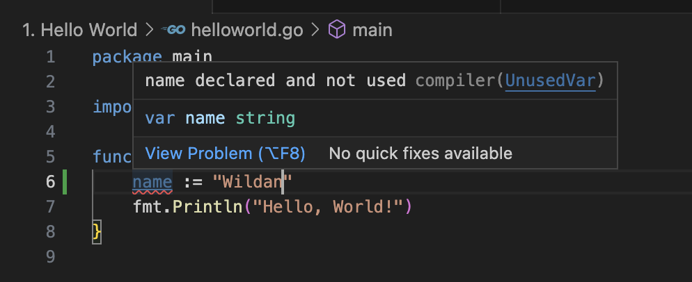

# Variable
Selanjutnya, kita bakal belajar tentang _gimana sih mendeklarasikan sebuah variable di Go?_

untuk mendeklarasikan sebuah variable di Go, kita dapat menggunakan keyword `var` seperti di bawah ini :
```go
var nama = "Wildan"
```
Ketika kita mendeklarasikan variable nama dan memberikan value "Wildan" pada variable tersebut, artinya kita membuat Go untuk mengidentifikasikan variable tersebut sebagai variable bertipe `String`

_Lalu bagaimana kalo kita ingin mendefinisikan variable tersebut terlebih dahulu?_

Caranya mudah, kalian cukup menambahkan tipe variable setelah nama variable. 

_Contohnya gimana tuh?_

```go
var nama string
var umur int
var lulus bool
```
Pada baris pertama contoh di atas, kita mendefinisikan variable nama sebagai variable bertipe `String`. Baris kedua, kita definisikan sebagai variable bertipe `Integer`. Dan baris ketiga, kita definisikan sebagai variable bertipe `Boolean`.

Selain menggunakan keyword `var`, kita juga bisa menggunakan operator `:=` untuk mendeklarasikan sebuah variable beserta dengan valuenya.

_Contohnya gimana tuh?_
```go
nama := "Wildan"
umur := 17
lulus : = true
```
Kita juga bisa mendeklarasikan sebuah variable dalam sebuah baris
```go
var nama, umur = "Wildan", 17

// atau

nama, umur := "Wildan", 17
```
Ketika kita membuat sebuah variable menggunakan keyword `var` atau menggunakan operator `:=`, nilai dari variable tersebut dapat kita assign/replace dengan nilai lainnya. Contohnya seperti apa?
```go
var nama string
nama = "Wildan" // variable nama bernilai Wildan
nama = "Iza" // variable nama bernilai Iza
```
_Lalu bagaimana kalau kita ingin membuat sebuah variable bernilai tetap?_

Nah, untuk membuat sebuah variable bernilai tetap, kita dapat menggunakan keyword `const`.
```go
const umur = 17
```
Dengan menggunakan keyword `const`, kita tidak dapat meng-_assign_ atau me-_replace_ value dari variable umur dengan value lainnya.
```go
const umur = 17
umur = 20 // error
```
## Aturan Membuat Variable
Dalam membuat variable, ada beberapa aturan yang perlu kita perhatikan :
- Nama sebuah variable, dapat mengandung huruf, angka dan garis bawah (_).  
- Setiap nama variable merupakan **Case Sensitive**. Artinya, variable NAma ≠ namA
- Apabila nama variable memiliki nama yang panjang, biasanya nama variable menggunakan CamelCase
- Apabila kita membuat sebuah variable namun variable tersebut tidak digunaka dimana-mana, maka variable tersebut akan memunculkan `error`


