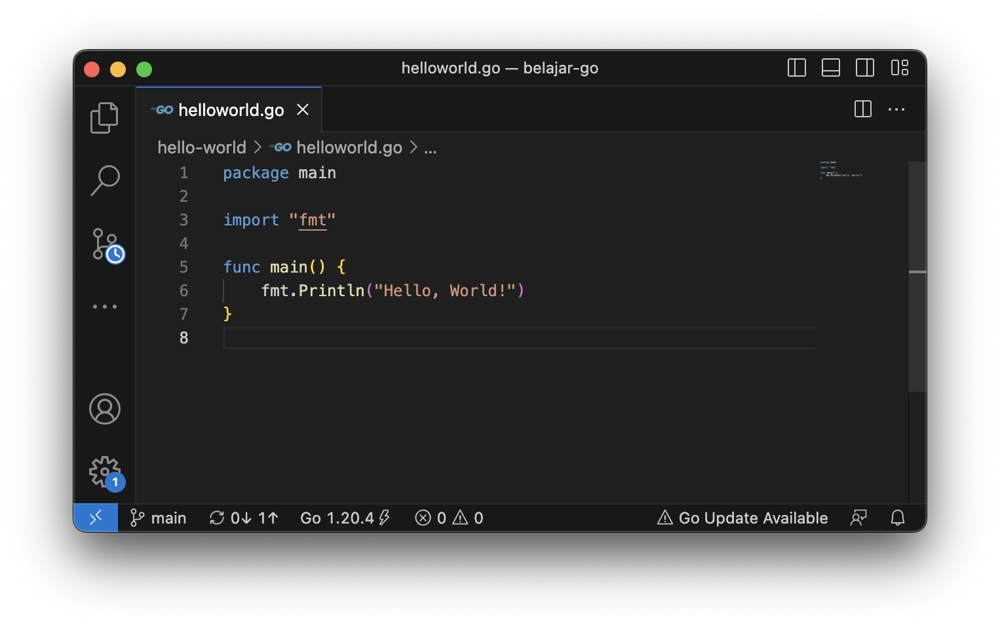
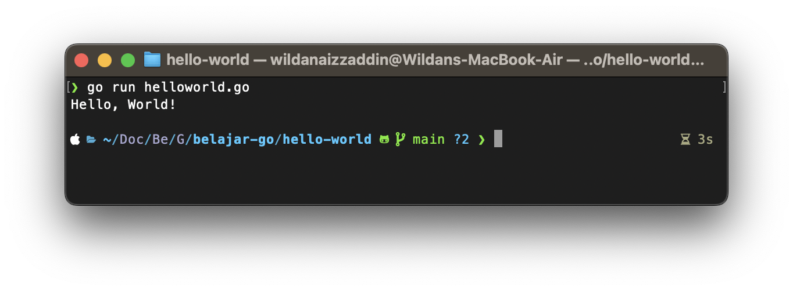
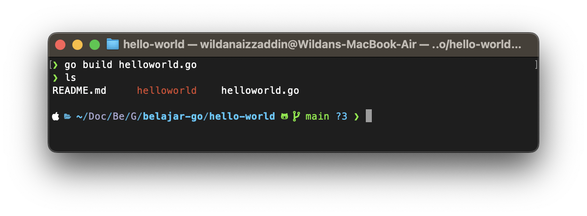
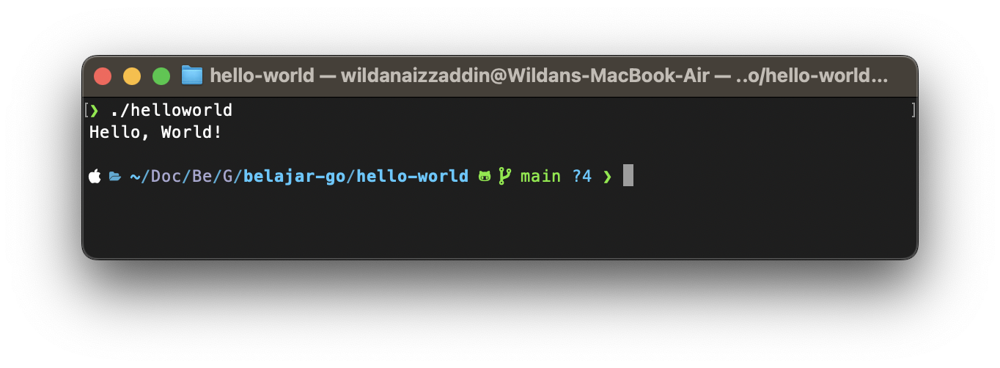

# Hello World
Kayaknya ngga _afdhol_ kalo setiap kita belajar bahasa pemrogaman baru, ngga bikin **Hello World!** 🤣🤣🤣

Okeh. kalo gitu saatnya kita eksekusi.

Langkah pertama yang perlu kalian lakukan adalah dengan membuat sebuah file dengan ekstensi berakhiran `.go`. Disini saya membuat sebuah file dengan nama `helloworld.go`

Jika sudah, silahkan kalian masukkan _snippet_ code dibawah ini
```go
package main

import "fmt"

func main() {
	fmt.Println("Hello World!")
}
```


## Membedah Hello World
Sebelum menjalankan program, kita bedah dulu _apa sih maksudnya code yang udah kita tulis?_
```go
package main
```
Ada beberapa hal yang perlu kalian ketahui tentang `package`. Setiap file `.go`, pasti memiliki `package` di awalnya. Karena `package` menunjukkan dimana sih kelompok nya si file `.go` tadi. Jadi ibaratnya, kalau ada dua file `.go` dengan package yang sama, berarti kedua file tersebut merupakan kelompok yang sama.

```go
import "fmt"
```
Selanjutnya adalah `import "fmt"`. Untuk mengimport sebuah package di Go, kita dapat menggunakan _keyword_ `import`.

Sedangkan `fmt`, merupakan sebuah package _built-in_ atau package yang sudah termasuk dalam Go yang digunakan untuk fungsi input/output.

```go
func main() {
	// your code here
}
```
Snippet code di atas merupakan snippet bagaimana kita membuat sebuah fungsi bernama `main`.
```go
fmt.Println("Hello World!")
```
`Println()` merupakan sebuah fungsi yang ada pada package `fmt` (yang sudah dijelakasn sebelumnya). Fungsi ini digunakan untuk menampilkan output. 

## Eksekusi
Untuk menjalankan program, kita dapat memasukkan perintah `go run <nama file.go>` pada cmd/terminal seperti gambar di bawah ini.

Selain itu, kita juga bisa membuat sebuah binnary file dari code yang kita buat, dengan menjalankan perintah `go build <nama file.go>` seperti gambar dibawah ini.

Ketika perintah tersebut selesai dijalankan, maka akan terbentuk sebuah file binnary baru dengan nama yang sama dengan nama file code yang _di-build_. 

Selanjutnya kita dapat langsung menjalankan program tersebut seperti gambar dibawah ini.
